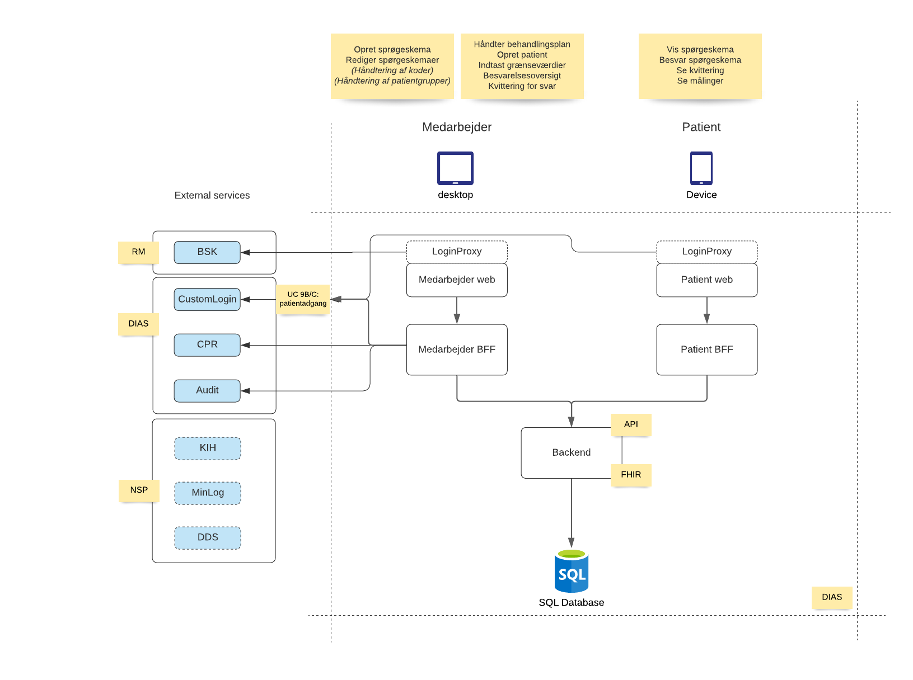
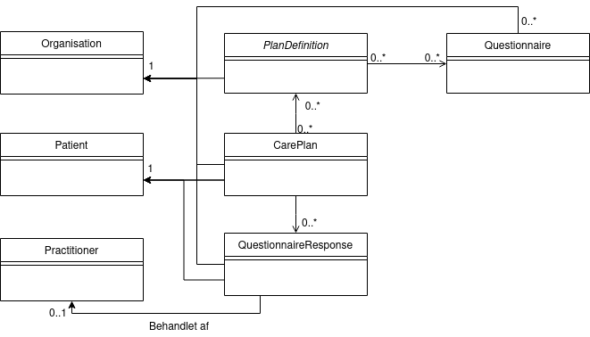

# KoMo-documentation

## Introduction

These pages contain the overall technical documentation for the services in the KoMo project. KoMo is short for "communication and monitoring" in Danish "KOmmunikation og MOnitorering". 
The project is funded by the Central Denmark Region (RM) and developed by RM and KvalitetsIT.

This repository contains the overall technical design and architectural documentation for the project as well as an overview of the constituent components.

## Design principles
The project uses the following design principles:

* Cross-cutting concerns are externalized 
  - Login (patient and employee). User authentication is done by external IdPs. Standards used OIDC or SAML.
  - Auditlog are done by using a external auditlog service.
* Use dedicated backends for each front end - backend for frontend(BFF).
* Standard FHIR model used when possible.

## Usecases
All usecases are documented. The most recent usecase document requested from RM.

<<Må vi lægge usecase dokumentet ud?>>

## Services
Services are created, testet and build in independant git repositories 

| Service       | Description   |
| ------------- |-------------|
| [Patient-web](https://github.com/KvalitetsIT/hjemmebehandling-patient-web)       | The web application for patient |
| [Medarbejder-web](https://github.com/KvalitetsIT/hjemmebehandling-medarbejder-web)     | The web application for employee(medarbejder) |
| [Patient-BFF](https://github.com/KvalitetsIT/hjemmebehandling-patient-bff)  | Dedicated API for patient |
| [Medarbejder-BFF](https://github.com/KvalitetsIT/hjemmebehandling-medarbejder-bff)  | Dedicated API for medarbejder |
| [BackendApi](https://github.com/KvalitetsIT/hjemmebehandling-hapi-fhir-server)  | A instance of a HAPI FHIR server |
| [Web-shared](https://github.com/KvalitetsIT/hjemmebehandling-web-shared) | Shared web components|

## Technical setup

The backend business functionality is exposed to external clients (apps) through patient and employee (health professional) backend-for-frontend (BFF) services. BFFs and input services encapsulate the central microservice-based infrastructure. The microservices inside the backend convert, store, process and exhibit incoming data. 

The main flow is
1. All calls for resources (javascript, html etc) or data (api) are received by the patient or medarbejder-web services. The loginproxies will force a login before resources or data are returned. 
2. Api calls are proxied to the BFFs. All Apis are Rest. 
3. The BFFs use a FHIRclient to communicate with the backend. The medarbejder BFF uses external services. These are described under integrations.
4. The backend is a standard FHIR server, that fetches and saves data in a Maria Database. The backend are build from the [HAPI FHIR server](https://hapifhir.io/)

## Integrations
KoMo integrates with the following systems

| Integration   | Description   | Standards | Documentation |
| ------------- |-------------| -----|-----|
| BSK (BrugerStamdataKatalog) | Is used for employee login. A JWT token containing user information and roles is parsed to the backend where user information are handled and access validated.  | OIDC / SAML | [DIAS documentation](https://git.base.dias.rm.dk/DIAS/dias-app-chart#oauth2-oidc) - login is required to view documentation  |
| CustomLogin | Is used when a patient login to the system. Patient users are automatically created in the CustomUser IdP using a Rest interface. It is possible to reset the password from the employee application. |OIDC and Custom Rest| [DIAS documentation](https://git.base.dias.rm.dk/DIAS/dias-custom-user-service) - login is required to view documentation |
| Audit service | Audit service is called from employee-bff when the employee reads or writes patient data | Custom Rest | [DIAS documentation](https://git.base.dias.rm.dk/Tenants/flux-kit/src/branch/master/README.md#audit-logs) - login is required to view documentation |
| CPR service | Cpr service is used to fetch master data for the patient. Data a fetched from a Cpr number | Custom Rest | [DIAS documentation](https://git.base.dias.rm.dk/DIAS/cpr-service) - login is required to view documentation |

## Model
The model is based on [FHIR](http://www.hl7.org/fhir/). All documentation of FHIR resources can be found at the HL7 website. 

The following FHIR Resources are used
 * carePlan 
 * patient
 * practitioner
 * organization
 * planDefinition
 * questionnaire
 * questionnaireResponse
 * searchParameter

The FHIR resources relates in the following way  

A number of extensions are made to the FHIR model. All extensions can be found in [Systems.java](https://github.com/KvalitetsIT/hjemmebehandling-medarbejder-bff/blob/main/service/src/main/java/dk/kvalitetsit/hjemmebehandling/constants/Systems.java)

The following is a short description of the extensions

| Extension       | Description   | Resources|
| ------------- |-------------| -------------|
| EXAMINATION_STATUS       | Is Used when a employee validates a questionnaire response. Valid values: "Ubehandlet" or "Behandlet" | QuestionnaireReposponse | 
| EXAMINATION_AUTHOR       | The employee who changed the questionnaire response to "Behandlet" |QuestionnaireReposponse |
| ORGANIZATION             | All patientrelated resources are assosiated with this extension. Added to make it easier to filter in organisation | Careplan, QuestionnaireReposponse |
| TRIAGING_CATEGORY        | Used to triage a QuestionnaireResponse. Valid values: GREEN(3), YELLOW(2), RED(1); | QuestionnaireReposponse | 
| ACTIVITY_SATISFIED_UNTIL | When a questionnaire need to be filled the next time | Careplan/CareplanActivity | 
| CAREPLAN_SATISFIED_UNTIL | When a questionnaire need to be filled the next time for the entire careplan | Careplan | 
| CONTACT_RELATIONSHIP     | The Relationship of a contact  | Patient |
| CUSTOM_USER_ID           | Used to save the userID returned by the customuser service. Example: 3cc36368-a721-4d18-b7e5-aa022fc4c07d | Patient |
| CUSTOM_USER_NAME         | Used to save the userName returned by the customuser service. This is the username used for login. It is shown in the employee UI if the user forgets. Example: Nantes | Patient |
| THRESHOLD                           | New resource that defines a threshold | Plandefinition, CarePlan| 
| THRESHOLD_QUESTIONNAIRE_ITEM_LINKID | Id to the Questionnaire item that uses the threshold |Threshold|
| THRESHOLD_TYPE                      | The different types of thresholds: NORMAL, ABNORMAL, CRITICAL |Threshold|
| THRESHOLD_VALUE_RANGE               | Defines the range for this threshold. Used if it is a value | Threshold |
| THRESHOLD_VALUE_BOOLEAN             | Defines the value for this threshold. Used if it is a Boolean | Threshold |

## Triage and Alarm limits
Definition:
* Alarm limits are the configuration values and which areas are Normal, Abnormal or Critical for a given type. Alarm limits can apply both for measurements and Boolean types.
* Triage are the actual priority for a Question / Questionnaire Response

Alarm Limits are defined in Questionnaire and PlanDefinition. The Alarm Limits are
 * NORMAL (Green)
 * ABNORMAL (Yellow)
 * CRITICAL (Red)
 
 There can only be one Alarm limit pr. measurement type in a PlanDefinition. If multiple PlanDefinitions are added to a CarePlan, KoMo will check that there is only one Alarm Limit for a measurement type.
 
Triage marks the priority of questions (a Questionnaire response typically has multiple questions) and questionnaire response (QR) as a whole.

A questionnaire response (QR) is triaged on the server, using the following rules
 1. The question with the highest severity marks the the entire QR (eg. if one question is marked as Red => the entire QuestionnaireResponse is marked red).
 2. If Alarm limits apply for a given type and the given value is outside any Alarm Limits. It will be triaged as "Red".
 3. If no alarm limits apply, the Question / Questionnaire response is triaged Green.
 4. The triage of Questionnaire Response is done when submitted. The triage value is evaluated based on the Alarm limits at that given time.
 5. The individual Questions are evaluated when they are shown. This means the triage value relates to the most current Alarm Limit. This is done (together with 4.) to handle changing Alarm limits and, at the same time, documentation is done correctly.

Measurements are numbered values. Measurements are shown in charts together with Alarm Limits. The Alarm Limits shown in the Charts are the most current (described in 5. above).

## Missing questionnairereposnses
When creating a careplan for a patient, a frequency for each questionnaire are defined by the clinician.

On the front page there is a list of patients who have missed a questionnairereponse deadline.

This list is recalculated when
* A patient submits a questionnaire response
* When a clinician alter the frequency for a existing questionnaire
* (Patientgroups are added or removed a active careplan - not yet support)

When a patient submits a questionnaire response, the next questionnairereposnse deadline is recalculated based on the date of the questionnaireresponse.

When a clinician alters the frequency for an existing questionnaire, existing alarms will be removed from the list. The deadline will be re-calculaed base on the day the clinician changed the frequency.

