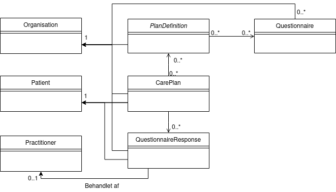
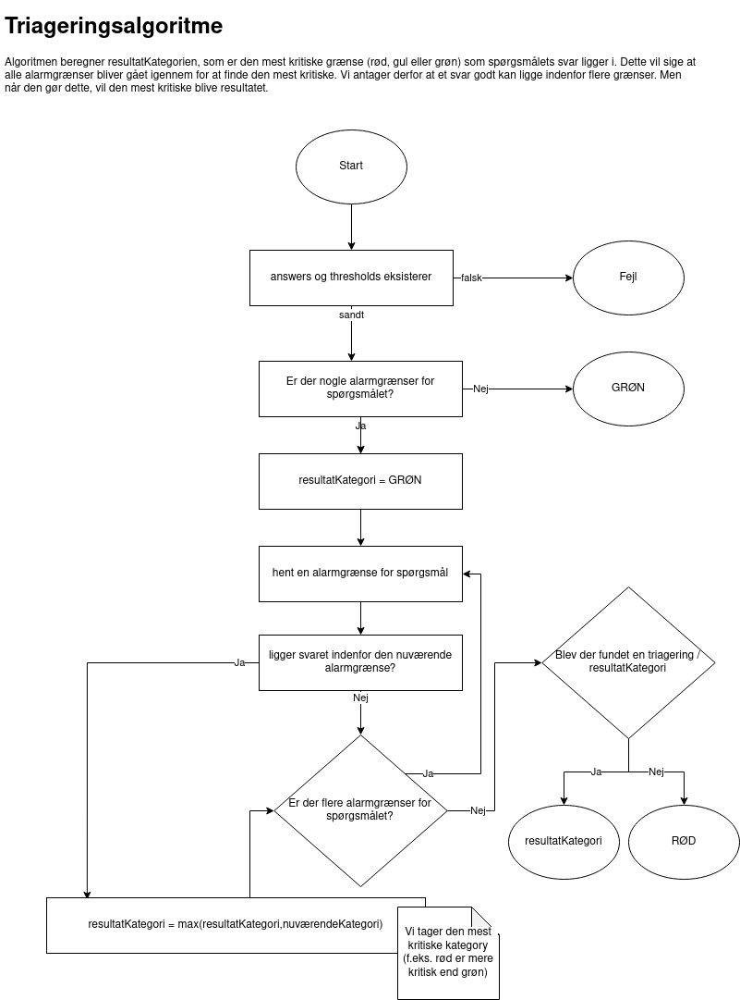
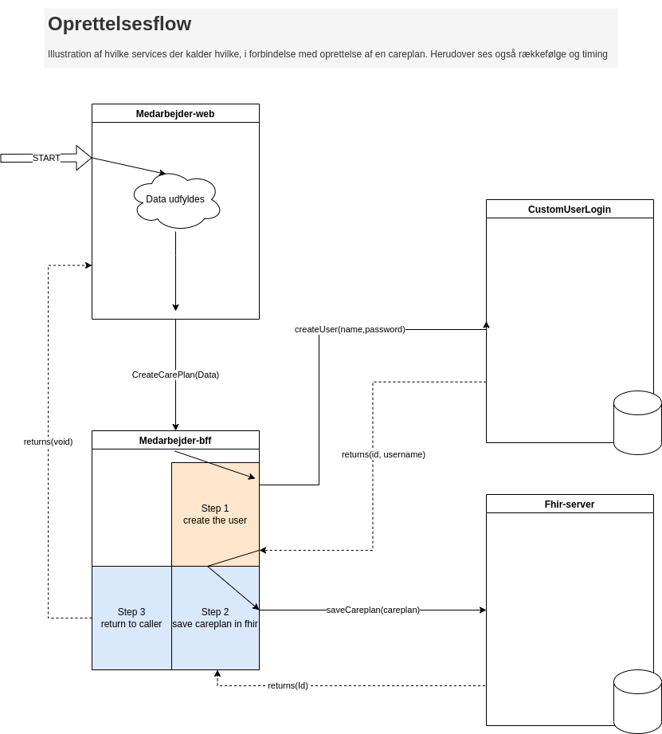

# Contents
1. [Technical drawings](#Technical-drawings)
    
    1. [Simple domain diagram](#Simple-domain-diagram)
    1. [Services](#Services)
    1. [Triagerings algorithm](#Triagerings-algorithm)
1. [Flows](#Flows)
    1. [Creationflow](#Creationflow)

# Technical drawings

## Simple domain diagram

## Services

## Triagerings algorithm

# Flows
## Creationflow
